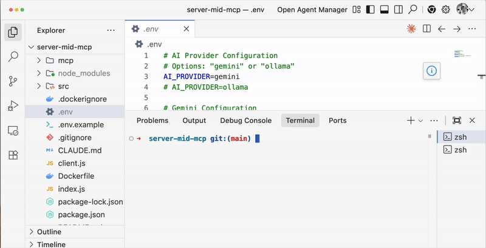

# pt8n_ado_t_test_agent_binary
v0.0.1

## Visualization

### GIF Demo

## Configuration

To configure the demonstration video generation:

1. **Create MCP Playwright Server**: Start a Model Context Protocol (MCP) server for Playwright.
2. **Tunnel Localhost**: Share your localhost URL using a tunnel. We recommend **ngrok**.
3. **Update Azure DevOps**:
    - Navigate to **Pipelines** > **Library**.
    - Find the **LLMModelVariables** variable group (preconfigured by the plugin).
    - Update the `MCPURI` variable: Paste your ngrok URL and append the suffix `/execute`.
    - **Save** the variables.